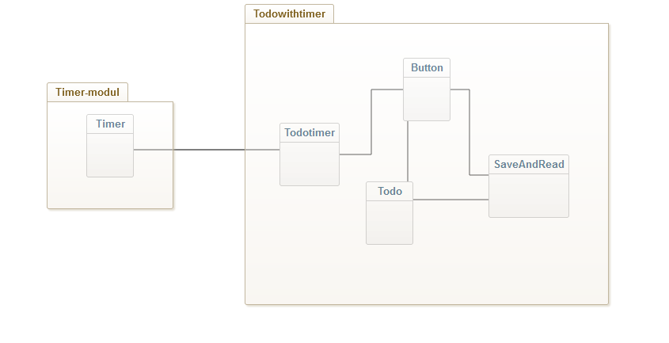

# Development

Here is an overview of how the application works and its structure.

## The application

This application is intended to help people organize their time, for example at work or school. 
The user can set up a task and estimate how long it will take to finnish. Then a timer can be started when the user wants to start the task. 
This will help the user to focus on the task, take breaks and keep track on the use of time.

The vision is to add functions like:

- Subtasks. So that you can build a task with several steps, like a recipe for doing a task.

- Save tasks you do often to a list for easy access.

- Prioritize tasks 

- And sort them

## How its built

The application is built on a timer module, that is not included in this repo.

## The Module

The Module can be found here [Module Repo](https://github.com/kw222mi/time_component).

The Module readme can be found here  [Module Readme](https://github.com/kw222mi/time_component/blob/main/README.md).

The Module test report can be found here Module Test Report [Test Report](https://github.com/kw222mi/time_component/blob/main/TESTRAPPORT.md).

## The structure

## Set up

Todo with timer is built with [vite](https://vitejs.dev/)

### clone the repo:

git clone `https://github.com/kw222mi/todoListWithTimer.git`

### install dependencies:

npm i

### serve with hot reload on localhost:

npm run dev

