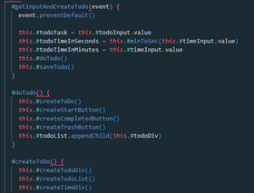
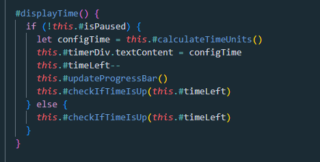
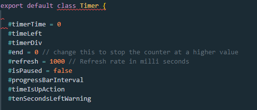
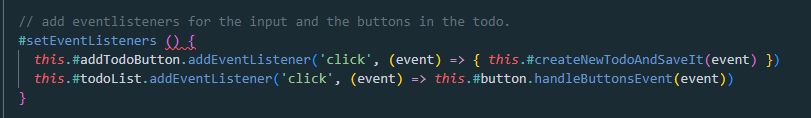

# Reflektioner

## Kapitel 2

Jag hamnar lätt i fällan att alla namn liknar varandra. Vilket gör att de blir svårt att skilja på dem och även att söka. Bland variablerna hittade jag både en timeDiv och en timerDiv, vilket kräver en viss koncentration för att inte göra fel, vilket är onödigt. När alla namn innehåller antingen timer, time eller todo blir det till brus som lätt står ivägen för förståelsen. Samtidigt finner jag det svårt att få bort det.

Jag hittade också dessa tre namn på metoder, där det är högst osäkert vad de egentligen gör utifrån namnen.

Jag försökte göra det tydligare genom att byta till följande

- getInputAndCreateTodo()  =>  createNewTodoAndSaveIt()

- doTodo()  =>  createTodoComponent()

- createToDo()  =>  createHtmlElements()

## Kapitel 3

Under denna kurs har jag blivit mycket bättre på att göra fler och mindre metoder från början. Istället för som tidigare, koda på och låta all kod hamna i samma metod, för att sedan städa upp. Jag känner att jag i och med det lättare får överblick över vad jag håller på med. Att metoder ska göra bara en sak är en bra tanke, men jag är inte helt förtjust när det leder till små metoder på en eller två rader ( Till exempel: add(a, b) {return a+b} ). Däremot tycker jag att det är väldigt viktigt att det inte ska finnas sidoeffekter. Vilket jag hela tiden upptäcker att jag har när jag börjar analysera koden jag skrivit.

Den här metod finns i min timermodul. Och jag har inte hunnit med att åtgärda den eftersom jag behöver bygga om hela klassen för att fixa det.

## Kapitel 4

Jag gillar tänket kring kommentarer i boken. Jag har skrivit en hel del JS-doc kommentarer som bara upprepar det som redan står i koden. Det gör en lite "dum i huvudet", man försöker bara beta av dem istället för att fundera över vad som verkligen behöver kommuniceras. Om man själv tvingas avgöra ifall en kommentar behövs eller inte så tvingas man tänka. Det var också en tankeställare det du sade på föreläsningen om att man kan behöva kommunicera vad koden inte gör också. Därför har jag hoppat över de flesta JS-doc kommentarerna, jag har dem i min Timer-klass för de metoder som är riktade till användaren. Känner att det är svårt att lägga sig på en rimlig nivå av information, att vara lagom tydlig. Det här är en av de delar jag har tyckt varit svårast.

Jag är nöjd när jag lyckas tillföra information, som här: 

Men har många ställen där jag blir osäker om jag behöver förtydliga och gör det då för säkerhetsskull:

Här skulle väl en namnändring kunna vara en del av lösningen, som  #todoList => #todoButtonList. Men det är egentligen inte sant för lyssnaren sitter på hela todocomponenten och inte på knapparna i sig, men själva eventen sker ju på knapparna.

## Kapitel 5

Formatteringen av koden gör mycket för läsbarheten. Merparten görs med hjälp av lint, allt från indentering, blankrader till längden på raderna. Kvar till mig blir att försöka ordna kod efter hur den förhåller sig till annan kod. Som att placera metoder som anropar andra metoder nära varandra. Enligt boken ska en metod som anropar en annan metod vara direkt ovanför denna så att man kan följa anropen. Så jag testade att ordna om Timer modulen efter detta. Innan hade jag odnat metoderna med de publika metoderna överst. Nu är det formatterat efter respektive metod, vilket gjort det lättare att se vilka delar som skulle kunna brytas ut till egna klasser. (Se mer under Kapitel 10) Jag gillade verkligen det som ett verktyg för att ordna koden. Dock tyckte jag att det blev sämre ur ett användarperspektiv då det var tydligare med alla publika metoder samlade i början. 

## Kapitel 6

Min timer modul tar emot en datastruktur i form av ett objekt. Detta gör det svårare om jag vill ändra någonting i själva strukturen, om jag exempelvis vill ändra från sekunder till millisekunder, eftersom jag då behöver ändra och anpassa flera metoder. Fördelen är att det går enklare att lägga till nya metoder i modulen vilket jag anser är användbart. 

I övrigt har jag använt mig av klasser som är objekt, där variablerna är privata, men där det finns publika metoder. Jag tycker att det är lättare att abstrahera och kapsla in koden när jag jobbar med appar i javascript och html. Jag antar att det har med event att göra, att man samlar koden som har med eventet att göra och sedan körs den om eventet löser ut. Det blir färre anrop mellan klasserna i och med att många klasser bara "tar hand om sitt eget". Som du sa på föreläsningen, man delar upp koden i småproblem som man löser och sedan får de lösningarna stå för sig själva och man behöver inte ägna sin tankeverksamhet åt dem mer. Jag uppfattar att det är lättare i javascript, men det kan ju också bero på att jag kan det bättre än till exempel java.

## Kapitel 7

En fördel med att få input via formulär i HTML är att man slipper en del av felhanteringen. Jag behöver inte kontrollera att det kommer in ett nummer i fältet för minuter och jag kan i HTML koden sätta ett intervall för vilka nummer jag tillåter (0 - 1000). I UML - kursen bröt vi under en föreläsning ut all validering i egna klasser vilket jag tyckte var en jättebra lösning, då jag tycker att felhantering blir brus när jag läser kod. 

Jag har inte särskilt mycket felhantering i min app som den är nu. Men om jag fortsätter att utveckla den skulle jag vilja byta ut den lokala lagringen mot exempelvis en databas. Då behöver jag felhantering för om det exempelvis inte går att koppla upp mot databasen. I boken ges ett förslag på hur man kan "wrappa" ett API, minimera antalet felkoder som kastas, minska beroendet, samt göra det lättare att testa. En sådan typ av lösning skulle jag vilja implementera.

## Kapitel 8

Boken tar upp problemet med att när man använder en modul så är den anpassad till att passa så många som möjligt och därför får man med mycket på köpet som man inte vill ha och även delar som kan ställa till det i ens eget program. När jag skulle använda min egen modul märkte jag dock motsatsen. Jag hade inte funderat tillräckligt över vad en tänkt användare skulle kunna ha behov av (inte ens min egen användning) och var därför tvungen att bygga på med flera metoder (att pausa och starta timern, samt att timern kunde ta bort sig själv när tiden var slut). Och det tänker jag är ett större problem än att det finns för många metoder. Skulle det dock varit så att Timer hade oönskade metoder som jag inte ville att någon skulle använda så hade jag byggt min TodoTimerklass så att den kapslade in Timer. Då skulle jag själv kunna bestämma vilka metoder som skulle vara tillgängliga utåt i och med att det bara är den klassen som pratar med Timer (i enlighet med The Law of Demeter).

## Kapitel 9

För den här uppgiften har jag bara gjort manuella tester. Så mina reflektioner utifrån boken blir utifrån det. Jag längtar efter att kunna skriva ordentliga tester eftersom jag nu, så snart jag gjort om någonting i koden (det har blivit en hel del refactoring) måste gå till appen och testa så att allt fungerar som det ska. Det är skönt att ha en liten app då. Att kunna köra ett gäng tester efter varje förändring för att med säkerhet få bekräftat att ingenting slutat fungera skulle underlätta och jag skulle inte dra mig lika mycket för att göra stora förändringar. Att skriva testerna efter liknande principer som övrig kod (att bara testa en sak åt gången, att tester inte ska vara beroende av varandra osv) låter som en självklarhet, men jag kan tänka mig att det ibland läggs mindre tid där.

Det finns ändå fördelar med manuell testning när det kommer till grafiska appar eftersom man på ett snabbt sätt ser om någonting har ändrats i utseendet. till exempel om det där inputfältet fortfarande är centrerat efter att man har lagt till en bild nedanför.

## Kapitel 10
 
Genom att formattera om koden efter de metoder som anropar varandra ser jag bättre, vilka variabler som hör samman med vilka metoder. 
Och det gör det lättare för mig att bryta ut klasser och skapa större "cohesion". Till exempel vill jag i Timer - modulen bryta ut en klass som är ansvarig för det som händer när tiden är slut. Jag märker att det blir svårt att ha översikt över mer än 200 rader kod och då är de ändå hyfsat väl organiserade. I L2 har jag jobbat mer med att bryta ut klasser och precis som med metoder så känns det enklare att göra det redan från början. Jag känner att jag skriver koden på ett annat sätt och det är också mycket lättare att hålla koden städad.

## Kapitel 11

Tidigare skapade jag en instans av klassen SaveAndRead i min todo klass för att kunna hämta det som sparats. Jag ändrade detta till att skicka in SaveAndRead till konstruktorn istället, en dependency injection, för att minska beroendet mellan todo och saveAndRead. Det gör det enklare för mig att byta till en annan form av lagring senare om jag vill.

Jag gjorde samma sak med todoTimer som blev lite av en adapter mellan koden från labb1 och labb2.
På så vis minskar beroendet till Timer och jag kan lättare byta till en annan timer om jag skulle hitta någon som är bättre.
