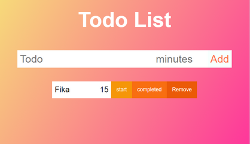
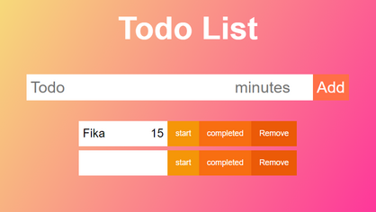
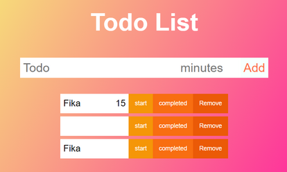
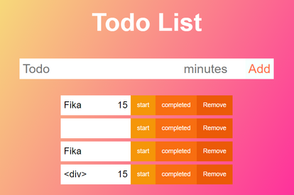
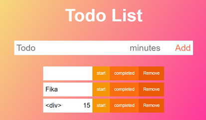
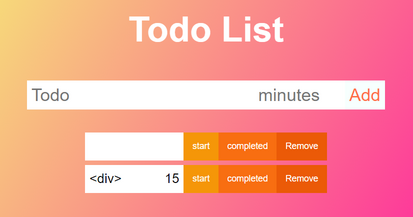
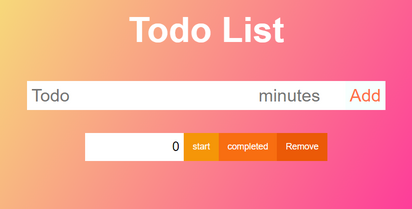
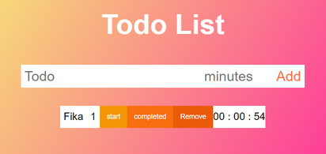
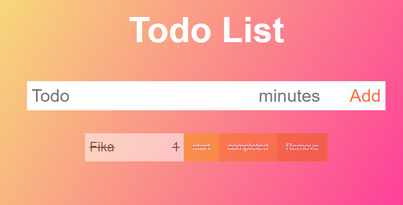

# Testrapport

## Sammanfattning

|Test| Utfall|
|-----|------|
| 1.1 | OK|
| 1.2 | OK|
| 1.3 | OK|
| 1.4 | OK|
| 2.1 | OK*|
| 2.2 | OK*|
| 2.3 | OK*|
| 3.1 | OK|
| 4.1 | OK|

* Testerna gick igenom. Men jag har noterat att det ibland, när man tar bort en todo och sedan uppdaterar, har försvunnit två todos istället för en.
Det händer inte varje gång, så det behöver debuggas ytterligare.

# Tester

## Lägg till todo

### 1.1 Input: 

Todo: Fika

minutes: 15

### Output:

### 1.2 Input: 

Todo:    (tomt)

minutes:     (tomt)

### Output:

### 1.3 Input: 

Todo: Fika

minutes: femton

### Output:

### 1.4 Input: 

Todo: `
`

minutes: 15

### Output:

## Ta bort todo

### 2.1 Ta bort den översta todon

### Output:

### 2.2 Ta bort todon i mitten

### Output:

### 2.3 Ta bort den sista todon

### Output:

## Starta tid

### 3.1 Lägg till todo Fika, 1 minut och tryck sedan på starta.

### Output:

## Completed

### 4.1 Lägg till todo Fika, 1 minut och tryck sedan på completed.

### Output:

