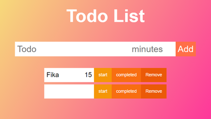
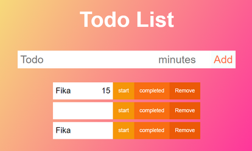
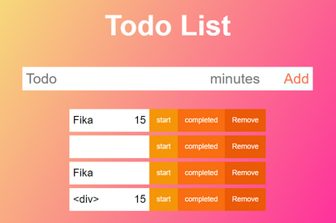
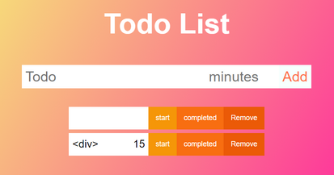
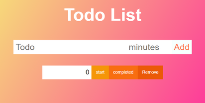
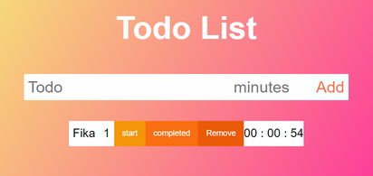
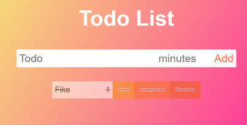

# Test

## Lägg till todo

### 1.1 Input: 

Todo: Fika

minutes: 15

### Output:

### 1.2 Input: 

Todo:    (tomt)

minutes:     (tomt)

### Output:

### 1.3 Input: 

Todo: Fika

minutes: femton

### Output:

### 1.4 Input: 

Todo: `
`

minutes: 15

### Output:

## Ta bort todo

### 2.1 Ta bort den översta todon

### Output:

### 2.2 Ta bort todon i mitten

### Output:

### 2.3 Ta bort den sista todon

### Output:

## Starta tid

### 3.1 Lägg till todo Fika, 1 minut och tryck sedan på starta.

### Output:

## Completed

### 4.1 Lägg till todo Fika, 1 minut och tryck sedan på completed.

### Output:

